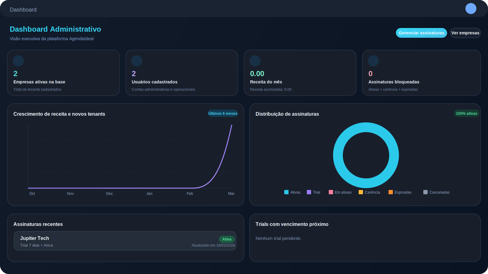

# Leonardo Justino | Portfolio

Portfolio profissional publicado com foco em posicionamento tecnico, produto e projetos web voltados para uso real.

O objetivo deste repositorio e apresentar minha forma de construir software: clareza de fluxo, contexto de negocio, interfaces orientadas a operacao e evolucao continua.

## Acesso rapido

- Site publicado: [leonardofelps.github.io/portfolio-leonardo](https://leonardofelps.github.io/portfolio-leonardo/)
- Repositorio: [github.com/LeonardoFelps/portfolio-leonardo](https://github.com/LeonardoFelps/portfolio-leonardo)
- Curriculo: [Curriculo_Leonardo_Justino.pdf](./assets/files/Curriculo_Leonardo_Justino.pdf)

## O que este portfolio comunica

- Posicionamento como desenvolvedor full stack com foco em PHP, Laravel, APIs REST, automacao e sistemas em producao
- Case principal de produto proprio com foco em agenda, operacao, financeiro e administracao
- Projetos publicos menores para demonstrar interface, interacao, estado local e organizacao de fluxos
- Presenca profissional centralizada em um unico lugar

## Stack usada neste repositorio

- HTML5
- CSS3
- JavaScript vanilla
- GitHub Pages
- SEO basico com metatags, Open Graph e JSON-LD

## O que este repositorio prova tecnicamente

- Capacidade de transformar posicionamento profissional em uma interface clara, consistente e responsiva
- Organizacao de projeto estatico com foco em deploy simples e manutencao direta
- Separacao entre landing principal e demos independentes
- Uso de JavaScript vanilla para estado de interface, filtros, persistencia local e interacoes sem dependencia de framework
- Preocupacao com discoverability tecnica, compartilhamento e apresentacao publica do trabalho

## Projetos em destaque

### 1. Portfolio principal

Landing page autoral com posicionamento profissional, secoes de apresentacao, case principal, projetos publicos e contato.

**Destaques**

- Hero section com proposta de valor clara
- Case principal do AgendaIdeal
- SEO com metadados para compartilhamento
- Estrutura leve, estatica e pronta para GitHub Pages
- Animacoes discretas com `IntersectionObserver`

**Preview**



### 2. AgendaIdeal

Produto proprio usado como principal prova de profundidade no portfolio. O foco e mostrar capacidade de pensar software para rotina real, nao apenas para demo visual.

**O que e destacado no site**

- Agenda semanal com foco operacional
- Modulos de financeiro, repasses e administracao
- Visao de produto em evolucao
- Relacao entre UX funcional, regra de negocio e sustentacao

### 3. Cashflow Snapshot

Miniaplicacao publica para demonstrar interface orientada a dados, resumo financeiro e manipulacao local de estado.

**Destaques**

- Cadastro manual de lancamentos
- Filtro por tipo
- Resumo com indicadores
- Persistencia com `localStorage`

**Abrir**

- [Demo local no portfolio](./starter-projects/cashflow-snapshot/index.html)
- [Codigo da demo](./starter-projects/cashflow-snapshot/)

### 4. Service Order Board

Quadro operacional para simular acompanhamento de ordens de servico com prioridade, status e interacao direta.

**Destaques**

- Drag and drop entre colunas
- Criacao e edicao rapida de ordens
- Filtro por prioridade
- Persistencia com `localStorage`

**Abrir**

- [Demo local no portfolio](./starter-projects/service-order-board/index.html)
- [Codigo da demo](./starter-projects/service-order-board/)

### 5. Webhook Inspector Lite

Painel leve para visualizacao de eventos recebidos, payloads e status de entrega, inspirado em cenarios de integracao e observabilidade operacional.

**Destaques**

- Lista de eventos com filtros
- Visualizacao de payload JSON
- Clone e remocao de eventos
- Persistencia com `localStorage`

**Abrir**

- [Demo local no portfolio](./starter-projects/webhook-inspector-lite/index.html)
- [Codigo da demo](./starter-projects/webhook-inspector-lite/)

## Estrutura do repositorio

```text
.
|-- assets/
|   |-- css/
|   |-- files/
|   |-- img/
|   `-- js/
|-- starter-projects/
|   |-- cashflow-snapshot/
|   |-- service-order-board/
|   `-- webhook-inspector-lite/
|-- index.html
|-- manifest.json
|-- robots.txt
`-- sitemap.xml
```

## Como rodar localmente

Como o projeto e estatico, basta abrir o `index.html` no navegador.

Se preferir servir localmente para testar links e caminhos:

```powershell
python -m http.server 8000
```

Depois acesse `http://localhost:8000`.

## Decisoes tecnicas

- Projeto mantido sem framework para carregamento rapido e deploy simples
- CSS organizado em arquivo unico para facilitar manutencao do layout principal
- JavaScript separado apenas para interacoes de navegacao, reveal e comportamento de interface
- Starter projects isolados em subpastas para funcionarem como demos independentes
- Estrutura pensada para publicacao direta no GitHub Pages

## Leitura recomendada para recrutador tecnico

- Comece pelo site publicado para ver posicionamento e narrativa
- Depois abra os starter projects para avaliar interacao, estado e organizacao do front-end
- Use este repositorio como ponto de entrada para entender como apresento produto, fluxo e contexto tecnico

## O que ainda pode evoluir

- README com GIFs ou capturas reais de cada projeto
- Publicacao de um projeto backend publico em Laravel para reforcar prova de engenharia
- Adicao de testes automatizados nos projetos publicos mais ricos
- Paginas dedicadas para cada case com detalhes de arquitetura, trade-offs e resultados

## Contato

- LinkedIn: [linkedin.com/in/leonardojustino](https://www.linkedin.com/in/leonardojustino)
- GitHub: [github.com/LeonardoFelps](https://github.com/LeonardoFelps)
- Workana: [workana.com/freelancer/46321a66b0c4beeb9580aecaa3323ba8](https://www.workana.com/freelancer/46321a66b0c4beeb9580aecaa3323ba8)
- E-mail: [leofevieira98@gmail.com](mailto:leofevieira98@gmail.com)
